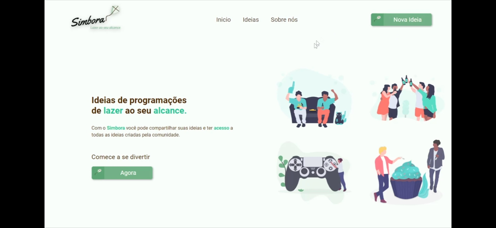
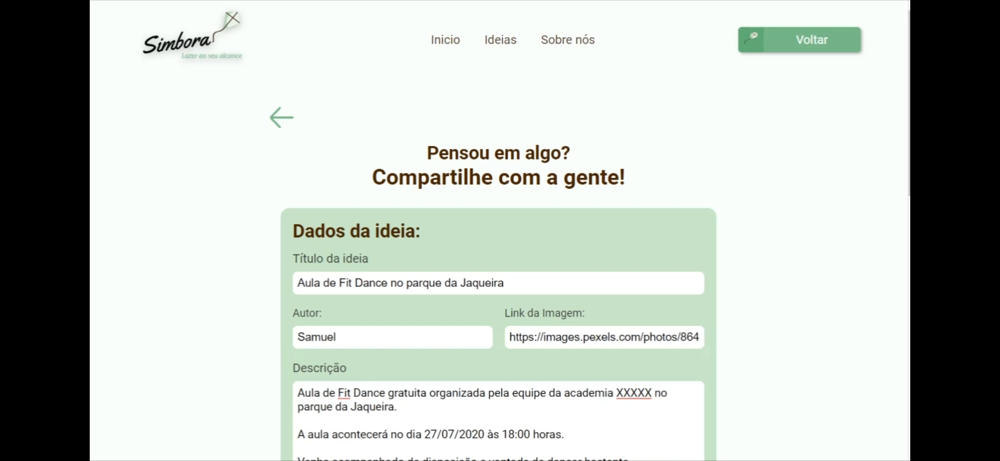
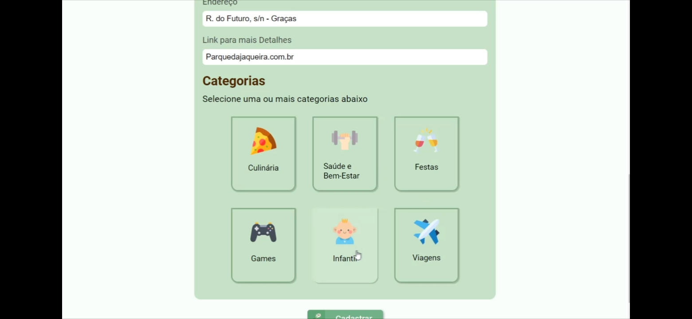
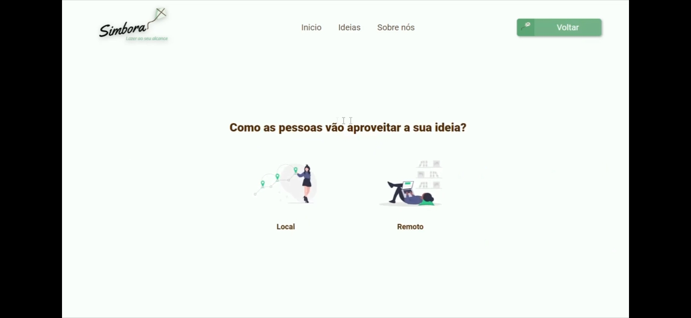
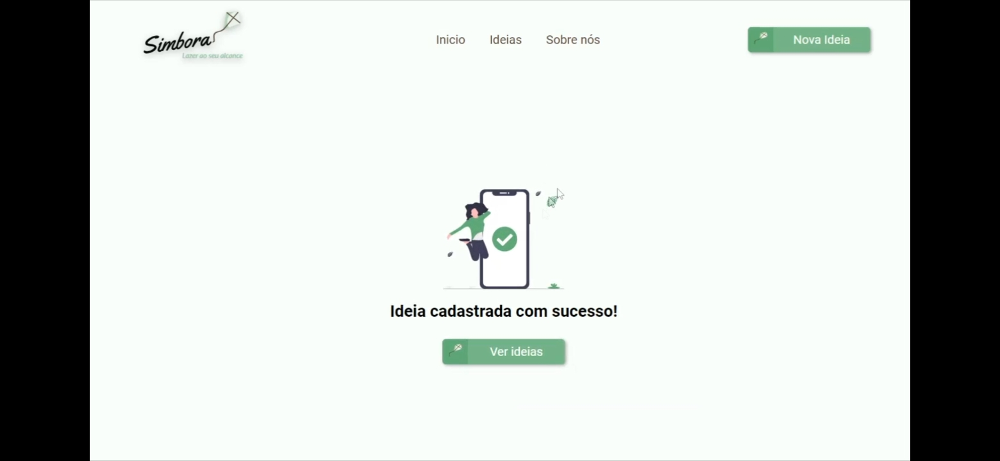
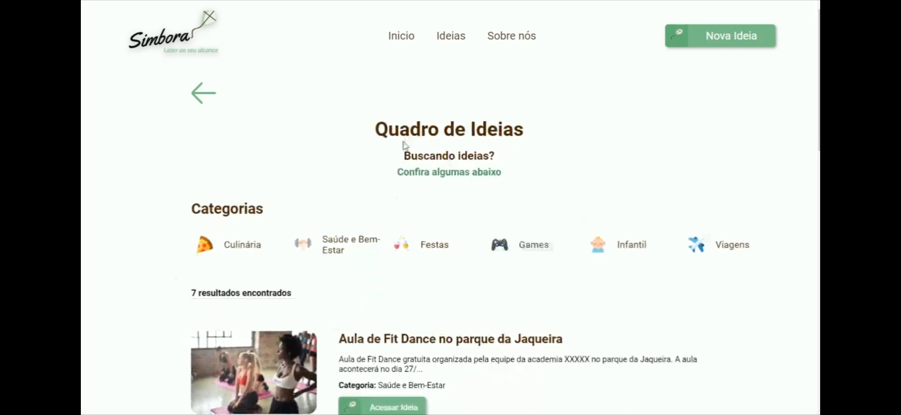

## Simbora :rocket:

O Simbora foi um projeto desenvolvido durante o período da faculdade na cadeira de Projeto Integrador na Faculdade Senac PE. O projeto consiste em uma plataforma para cadastros e divulgações de atividades de lazer gratuitas. Essas atividades podem ser cadastradas com duas flags: Remotas (que podem ser acessadas de qualquer lugar) e Locais (que estão atividades que estão próximas de você).

## Screenshots do projeto

## Tecnologias utilizadas :computer:

1. Front-End: React
1. Back-End: NodeJS
1. Database: SQlite3

## Como executar o projeto :fire:

1. Clone o repositório
1. Execute o comando `npm install` para adicionar todas as extensões dentro da pasta `/Back`
1. Rode o comando `npm run dev` na pasta `Back` para iniciar o servidor
1. Execute o comando `yarn install` para adicionar todas as extensões dentro da pasta `/front`
1. Rode o comando `yarn start` na pasta `frontend/simbora` para iniciar o front-end

#### Go Dev! :checkered_flag: Jonisson Gomes da Silva :checkered_flag:	
